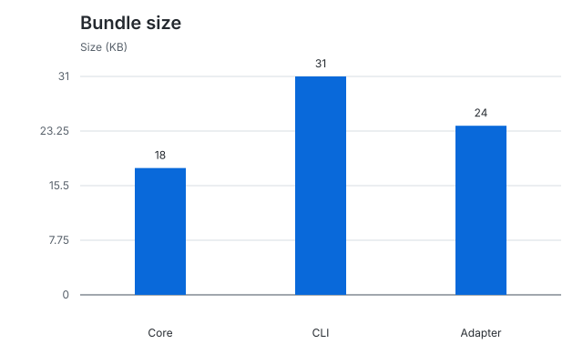

# chart.md

**Charts for README.md.** Charts belong in Markdown too.

Generate static SVG charts from Markdown tables using TypeScript.



## Quick start

Milestone 1 supports one vertical bar chart with one numeric series. Packages
remain private while the initial API is being developed; run from this checkout.

Use Node.js 22.13+ or 24+ and pnpm 10.17.1.

```sh
pnpm install --frozen-lockfile
pnpm build
node packages/cli/dist/index.js render examples/basic/example.md
```

This writes `chart.svg` in the current directory. Embed it using a normal
Markdown image reference: ``.

The source in [examples/basic/example.md](examples/basic/example.md):

````md
```chart
type: bar
title: Bundle size
unit: KB

| Package | Size |
| --- | ---: |
| Core | 18 |
| CLI | 31 |
| Adapter | 24 |
```
````

## CLI

```sh
node packages/cli/dist/index.js render example.md
node packages/cli/dist/index.js render example.md --output bundle-size.svg
node packages/cli/dist/index.js --help
```

Output paths are relative to the current directory; their parent directory must
exist. Existing files are preserved: choose a new output path or remove an old
SVG before regenerating it. Errors are printed to stderr with a nonzero exit code.
Parsing errors include source line numbers where available.

## Syntax and current limits

- Input is a chart body or a Markdown document containing exactly one `chart`
  fence. Backtick and tilde fences are accepted. Charts inside example fences
  are ignored. Multiple charts and fence options are reserved for the next milestone.
- `type: bar` is required. `title:` and `unit:` are optional plain text, with no
  YAML quoting or nesting. Unknown and duplicate keys are errors.
- Tables require two columns, a header, a separator, and 1–40 data rows.
  Every row must start and end with `|`. Separator cells use at least three dashes
  and optional alignment colons. Escaped pipes and inline Markdown are not parsed.
- The first column contains labels; the second contains finite decimal or
  scientific-notation numbers. Negative values and zero are supported. Nonzero
  magnitudes must be between `1e-9` and `1e12`; commas and units in cells are rejected.
- SVGs use a white background, blue bars, and a zero-inclusive axis. Long category
  labels and headings are shortened visually; full text remains in accessible
  descriptions and SVG titles. Charts widen for larger datasets.
- Output is deterministic and contains no scripts, network references, or browser
  dependencies. Dark themes and more chart types are planned for later milestones.

## Programmatic API

After building, the `@chartmd/core` workspace package exposes:

```ts
import { parse, render, type ChartDefinition } from '@chartmd/core';

const chart: ChartDefinition = parse(source);
const svg: string = render(chart);
```

`parse` reads Markdown into a definition; `render` validates that definition and
returns standalone SVG. You can also construct a definition directly:

```ts
const chart: ChartDefinition = {
  type: 'bar',
  title: 'Bundle size',
  unit: 'KB',
  labels: ['Core', 'CLI'],
  series: { name: 'Size', values: [18, 31] },
};
```

## Development

```sh
pnpm build
pnpm test
pnpm typecheck
pnpm lint
pnpm format:check
```

`pnpm test` builds the packages and runs parser, renderer snapshot, and CLI
integration tests. `pnpm test:watch` builds once; run `pnpm build` after changing
package source to refresh the CLI used by integration tests. Use `pnpm format`
to apply formatting.

- `packages/core` — parser, chart model, and dependency-free SVG renderer.
- `packages/cli` — file input, argument validation, and SVG output.
- `tests` — unit, snapshot, and integration tests.
- `examples/basic` — a working source file and its generated SVG.

CI validates Node.js 22 and 24. Run `pnpm changeset` for user-facing changes;
see [.changeset/README.md](.changeset/README.md). Publishing is not configured.

## Next milestone

Milestone 2 adds README compilation: multiple chart blocks, stable chart IDs,
SVG filenames, output directories, and `chartmd build README.md`.
