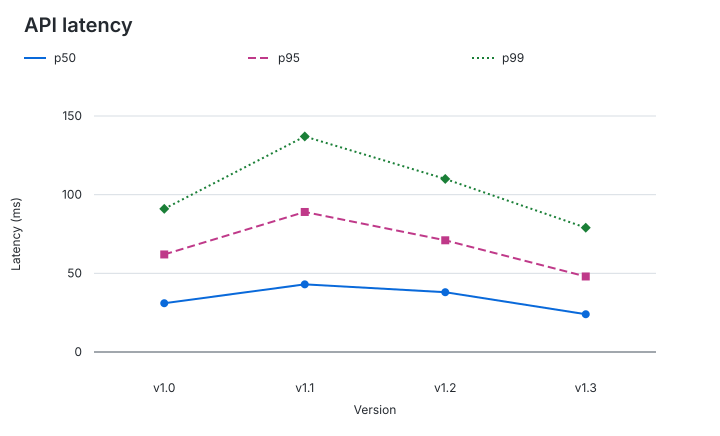
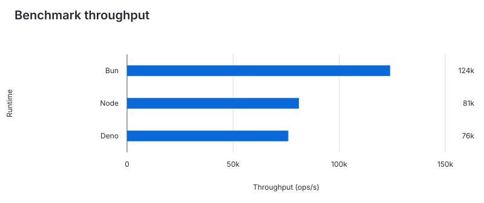
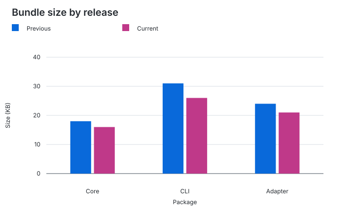
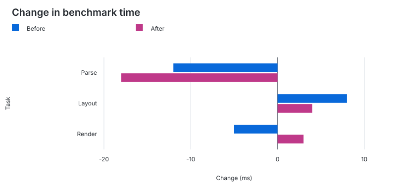

# Chart engine examples

Build from the repository root:

```sh
node packages/cli/dist/index.js build examples/engine/README.md --output examples/engine/charts
```

## Latency trends

Line categories are equally spaced and retain their source order. Numeric-looking
labels are still categories, not continuous numeric coordinates. Additional
columns become series, with colors, markers, and dash patterns for identification.

```chart id="latency"
type: line
title: API latency
unit: ms
x: Version
y: Latency

| Version | p50 | p95 | p99 |
| --- | ---: | ---: | ---: |
| v1.0 | 31 | 62 | 91 |
| v1.1 | 43 | 89 | 137 |
| v1.2 | 38 | 71 | 110 |
| v1.3 | 24 | 48 | 79 |
```



## Horizontal bars

Longer category names fit beside horizontal bars. Axis captions describe the
physical axes: `x` is the horizontal numeric axis, `y` the vertical category axis.

```chart id="runtime"
type: horizontal-bar
title: Benchmark throughput
unit: ops/s
x: Throughput
y: Runtime

| Runtime | Throughput |
| --- | ---: |
| Bun | 124000 |
| Node | 81000 |
| Deno | 76000 |
```



## Grouped bars

Multiple columns produce side-by-side bars on a shared zero-inclusive scale.

```chart id="bundle-comparison"
type: bar
title: Bundle size by release
unit: KB
x: Package
y: Size

| Package | Previous | Current |
| --- | ---: | ---: |
| Core | 18 | 16 |
| CLI | 31 | 26 |
| Adapter | 24 | 21 |
```



## Signed values

```chart id="signed-changes"
type: horizontal-bar
title: Change in benchmark time
unit: ms
x: Change
y: Task

| Task | Before | After |
| --- | ---: | ---: |
| Parse | -12 | -18 |
| Layout | 8 | 4 |
| Render | -5 | 3 |
```


