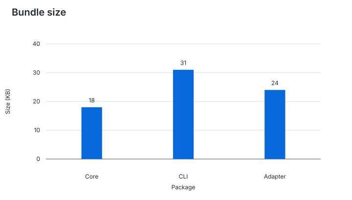
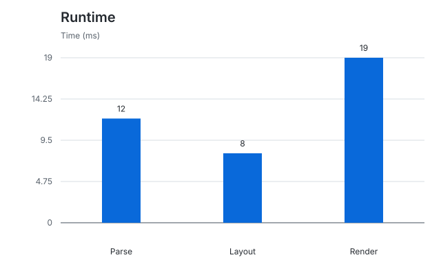

# Benchmark report

Build this example from the repository root:

```sh
node packages/cli/dist/index.js build examples/readme/README.md --output examples/readme/charts
```

## Bundle size

This explicit ID keeps the filename stable when the title changes.

```chart id="bundle-size"
type: bar
title: Bundle size
unit: KB

| Package | Size |
| --- | ---: |
| Core | 18 |
| CLI | 31 |
| Adapter | 24 |
```



## Runtime

The title supplies the filename `runtime.svg`.

```chart
type: bar
title: Runtime
unit: ms

| Task | Time |
| --- | ---: |
| Parse | 12 |
| Layout | 8 |
| Render | 19 |
```


